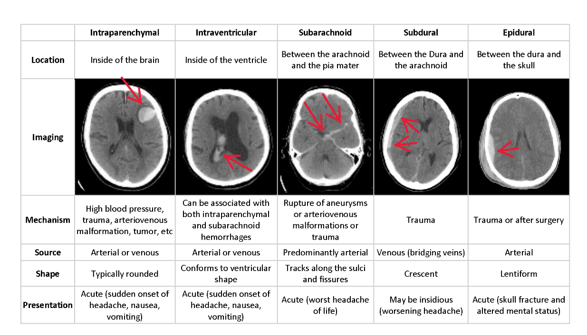

# intracranial-hemorrhage-detection
Repo for RSNA intracranial hemorrhage detection. Instructions for reproducability can be found below.

## Overview
Intracranial hemorrhage (bleeding within the cranium) accounts for ~10% of strokes in the U.S., where stroke is the fifth-leading cause of death. There are several types of hemorrhage and indentifying/locating them in a patient quickly is not only a matter of life and death, but speed also plays a critical part in the quality of life a survior can expext post recovery.

Diagnosing and locating an intracranial hemorrhage from neurological symptoms (e.g. severe headache or loss of consciousness) and medical imagery is a complicated, time consuming process requiring a highly trained spcialist. A technology solution would enhance the speed and diagnostic ability of medical practioners as well as potentially provide diagnostic ability or relief to patients who are not near an expert. Our goal is to build a model and system which detecs acute intracranial hemorrhages and its subtypes. 


## Data
The dataset has been provided by the Radiological Society of North America (RSNA®) in collaboration with members of the American Society of Neuroradiology and MD.ai.

## Model
* Test Submission: First approach was the test the submission script and manually mark each subtype, including All, with a probability value of 0.15
* Naive Baseline: Pass


## Evaluation
Model evaluated using a weighted multi-label logarithmic loss (same as cross-entropy for all intents and purposes). Using the minmax rule to avoid undefinned predictions at {0,1}, offset by a small epsilon: max(min(p, 1−10^−15), 10^-15).

## Team
- Chris Chen
- Tony Reina
- Kyle Shannon

## Getting Started
Instructions for deploying our codebase and reproducing our results:
1. Run the Docker script to create a GPU ready linux container. (We assume you will be using Nvidia GPUs on a Linux based system.
2. Ensure that the conda environment was set up properly and matches the .yaml environment configuration. 
3. Set your paths to the training and test data in the src/config.ini file. 
4. You can recreate our exact train/validate/test splits using the ```create_label_file.py``` script, alternatively we have provided those csv files for convienance.
